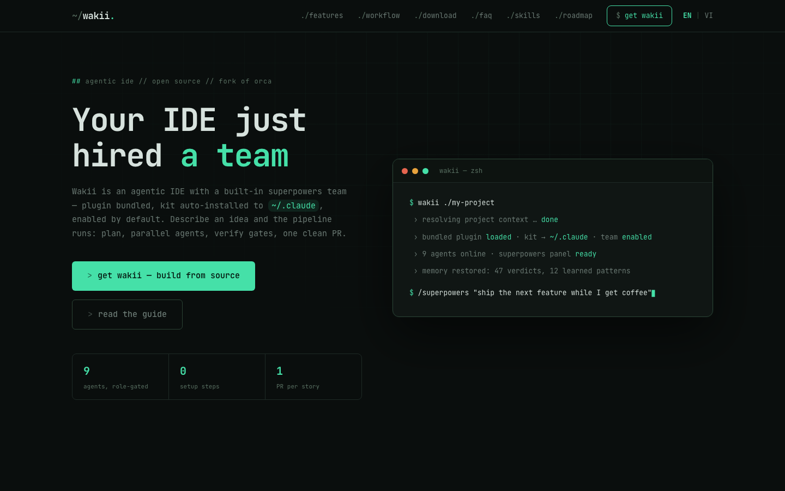
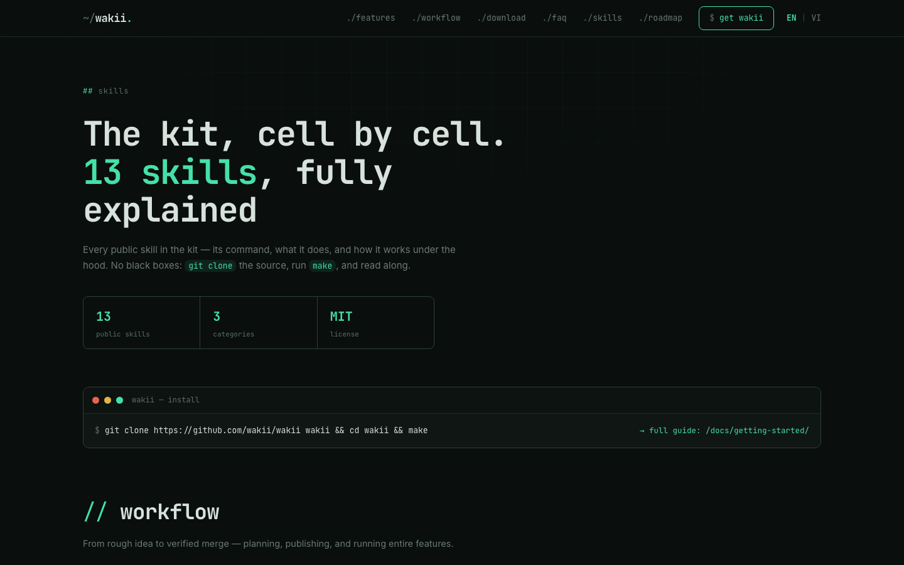

<div align="center">


# Wakii

### The agentic IDE with a built-in superpowers team

[](https://github.com/wakii-dev/wakii-site/actions/workflows/ci.yml)
[](https://github.com/wakii-dev/wakii-site/actions/workflows/deploy.yml)
[](https://wakii.dev)
[](https://astro.build)
[](https://github.com/wakii-dev/wakii/releases)



**[wakii.dev](https://wakii.dev)** · [Docs](https://wakii.dev/docs/getting-started/) · [Skills](https://wakii.dev/skills/) · [Roadmap](https://wakii.dev/roadmap/) · [Download](https://wakii.dev/download/)

This repository holds the source of the official website — built with
[Astro](https://astro.build), deployed on Vercel, bilingual
(English / Tiếng Việt), fully static.

</div>

## Highlights

- **Static & content-first** — a 19-page Astro 5 build. No client framework;
  content lives in typed data modules and markdown collections.
- **Bilingual by design** — every page ships in English and Tiếng Việt
  (`/vi/*` mirror), strings sourced from `src/i18n/`.
- **The kit, in the open** — 21 built-in skills, 13 documented in the public
  [skills catalog](https://wakii.dev/skills/) with commands and internals.
- **Dark bento design system** — custom design tokens (`src/styles/tokens.css`)
  and a shared motion layer, no UI framework.

<div align="center">

</div>

## Pages

| Route       | Purpose                                                                        |
| ----------- | ------------------------------------------------------------------------------ |
| `/`         | Landing — product positioning, feature highlights, CTAs                        |
| `/skills`   | Public skills catalog — command, description, and internals per skill (EN+VI)  |
| `/docs/*`   | Guides: getting started, superpowers panel, story workflow, agents & kit, FAQ  |
| `/roadmap`  | Public roadmap — Now / Next / Later                                            |
| `/download` | Direct downloads for macOS (Windows pending), QR code for mobile connect       |
| `/vi/*`     | Vietnamese version of the site                                                 |

## Quick start

```bash
pnpm install
pnpm dev      # local dev server
pnpm build    # static build to dist/
pnpm preview  # preview the production build
```

Requires Node 18.17+ (Astro 5).

## Project structure

```
src/
  config.ts        # single source of truth: REPO_URL, SITE_URL, SITE_NAME,
                   # SITE_TAGLINE, DOC_SLUGS (locked contract), download flags
  content/docs/    # markdown docs (content collections)
  data/            # skills.ts (21-skill catalog), roadmap.ts (Now/Next/Later)
  i18n/            # EN + VI strings (landing, download, …)
  components/      # Astro components
  layouts/         # page layouts
  pages/           # file-based routes (+ /vi locale mirror, 404, robots.txt)
public/            # static assets
```

<details>
<summary><strong>Editing content</strong></summary>

- **Docs** — add/edit markdown under `src/content/docs/`. The doc slugs are a
  locked contract (`DOC_SLUGS` in `src/config.ts`): `getting-started`,
  `superpowers-panel`, `story-workflow`, `agents-and-kit`, `faq`.
- **Skills catalog** — `src/data/skills.ts` mirrors the frontmatter of the
  skills in the product; `public: true` marks catalog-worthy skills (13 of 21
  are public).
- **Roadmap** — `src/data/roadmap.ts`, grouped by `Now / Next / Later`
  (bilingual labels).
- **Download flags** — direct-download availability is flag-controlled in
  `src/config.ts`. Flag flips are **user/manual only**.

</details>

<details>
<summary><strong>Deployment</strong></summary>

The site deploys to **Vercel** via GitHub Actions (`deploy.yml`, production on
push to `main`; `ci.yml` runs the build check on every PR). Canonical
production URL: `https://wakii.dev` — sitemap and `robots.txt` derive from
`SITE_URL` in `src/config.ts`.

> `REPO_URL` points to the public product repo
> [`wakii-dev/wakii`](https://github.com/wakii-dev/wakii), where release
> `v1.4.197` hosts the macOS builds (`Wakii.dmg` Apple Silicon,
> `Wakii-x64.dmg` Intel). `DOWNLOADS_LIVE` is on; the Windows asset
> (`WakiiSetup.exe`) lands with the first Windows build.

</details>

## Contributors

- **HoiVu** — author / product owner
- **Claude** (Anthropic) — AI coding agent
- **Kiro** (AWS) — AI coding agent
